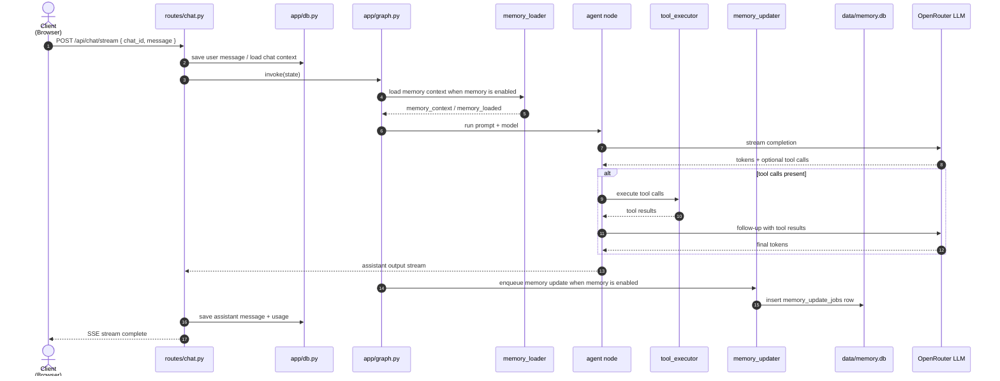
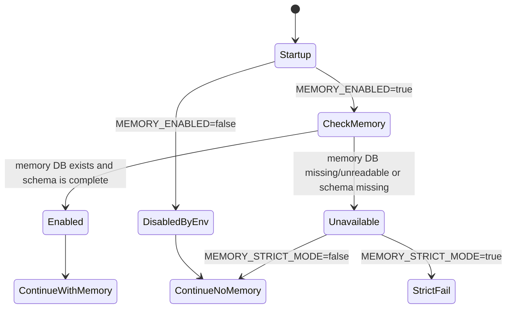
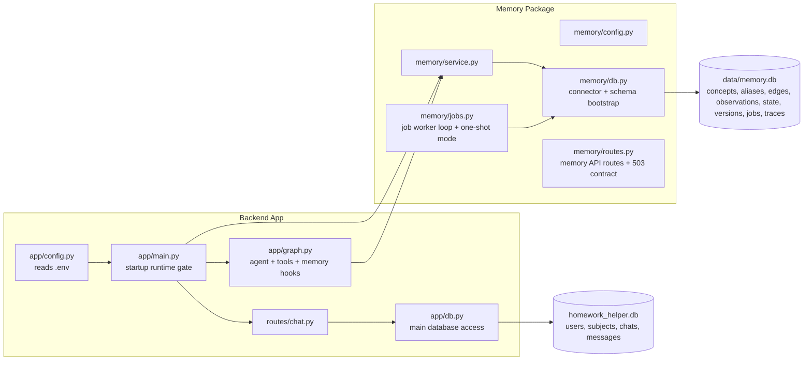
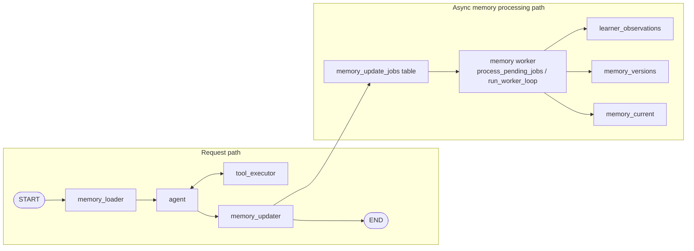

# Architecture Diagrams

## 1. Chat API Flow

```mermaid
sequenceDiagram
    autonumber
    actor Client as Client<br/>(Browser)
    participant ROUTE as routes/chat.py
    participant APPDB as app/db.py
    participant GRAPH as app/graph.py
    participant MLOAD as memory_loader
    participant AGENT as agent node
    participant TOOLS as tool_executor
    participant MUPDATE as memory_updater
    participant MEMDB as data/memory.db
    participant LLM as OpenRouter LLM

    Client->>ROUTE: POST /api/chat/stream { chat_id, message }
    ROUTE->>APPDB: save user message / load chat context
    ROUTE->>GRAPH: invoke(state)

    GRAPH->>MLOAD: load memory context when memory is enabled
    MLOAD-->>GRAPH: memory_context / memory_loaded

    GRAPH->>AGENT: run prompt + model
    AGENT->>LLM: stream completion
    LLM-->>AGENT: tokens + optional tool calls

    alt tool calls present
        AGENT->>TOOLS: execute tool calls
        TOOLS-->>AGENT: tool results
        AGENT->>LLM: follow-up with tool results
        LLM-->>AGENT: final tokens
    end

    AGENT-->>ROUTE: assistant output stream
    GRAPH->>MUPDATE: enqueue memory update when memory is enabled
    MUPDATE->>MEMDB: insert memory_update_jobs row
    ROUTE->>APPDB: save assistant message + usage
    ROUTE-->>Client: SSE stream complete
```

## 2. Runtime Memory Gate

```mermaid
stateDiagram-v2
    [*] --> Startup

    Startup --> DisabledByEnv: MEMORY_ENABLED=false
    Startup --> CheckMemory: MEMORY_ENABLED=true

    CheckMemory --> Enabled: memory DB exists and schema is complete
    CheckMemory --> Unavailable: memory DB missing/unreadable or schema missing

    Unavailable --> StrictFail: MEMORY_STRICT_MODE=true
    Unavailable --> ContinueNoMemory: MEMORY_STRICT_MODE=false

    DisabledByEnv --> ContinueNoMemory
    Enabled --> ContinueWithMemory
```

## 3. Deployment Data Topology

```mermaid
flowchart LR
    subgraph APP[Backend App]
        CFG[app/config.py\nreads .env]
        MAIN[app/main.py\nstartup runtime gate]
        CHAT[routes/chat.py]
        GRAPH[app/graph.py\nagent + tools + memory hooks]
        MAINDB[app/db.py\nmain database access]
    end

    subgraph MEM[Memory Package]
        MCFG[memory/config.py]
        MSVC[memory/service.py]
        MDB[memory/db.py\nconnector + schema bootstrap]
        MROUTES[memory/routes.py\nmemory API routes + 503 contract]
        MJOBS[memory/jobs.py\njob worker loop + one-shot mode]
    end

    APP_SQL[(homework_helper.db\nusers, subjects, chats, messages)]
    MEM_SQL[(data/memory.db\nconcepts, aliases, edges, observations, state, versions, jobs, traces)]

    CFG --> MAIN
    MAIN --> CHAT
    MAIN --> GRAPH

    CHAT --> MAINDB --> APP_SQL
    MAIN --> MSVC
    MSVC --> MDB --> MEM_SQL

    GRAPH --> MSVC
    MJOBS --> MDB
```

## 4. Runtime Topology

```mermaid
flowchart LR
    subgraph RequestPath[Request path]
        S([START]) --> L[memory_loader]
        L --> A[agent]
        A <--> T[tool_executor]
        A --> U[memory_updater]
        U --> E([END])
    end

    subgraph AsyncPath[Async memory processing path]
        J[memory_update_jobs table] --> W[memory worker\nprocess_pending_jobs / run_worker_loop]
        W --> O[learner_observations]
        W --> V[memory_versions]
        W --> C[memory_current]
    end

    U --> J
```
