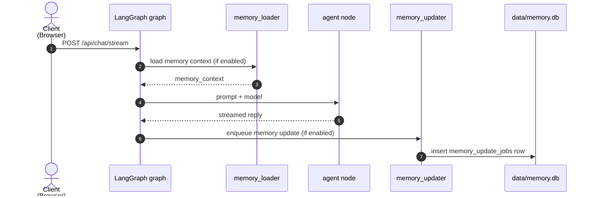
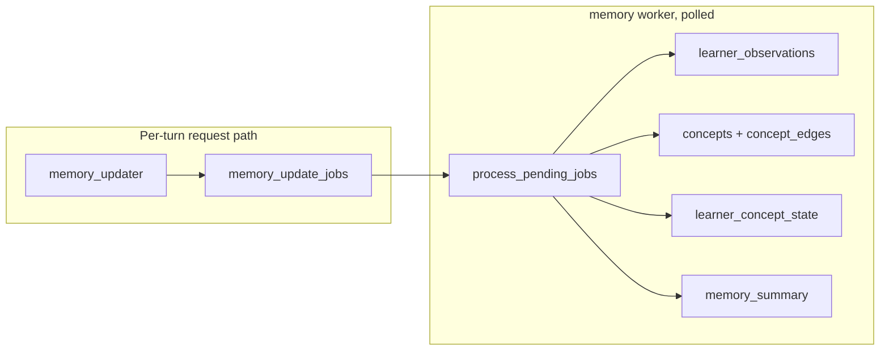

# Architecture

A high-level map of the system, written for developers joining the project. It
deliberately skips implementation internals — those live in the code and can
change. When a section names a file, that's where you'll find the real detail.

## Big picture

- **Backend (`backend/`)** — FastAPI app serving the API, a LangGraph graph for
  chat turns, and a standalone memory package. See `backend/app/` and `backend/memory/`.
- **Frontend (`frontend/`)** — React chat UI (Vite). Talks to the backend only via `/api`.
- **Debug page (`frontend-debug/`)** — admin-only UI (read views + a SQL editor), non-prod.
- **Data (`data/`)** — SQLite databases plus seed files.

## Core concepts

- **subject**: the global divisor. Subjects don't overlap; one subject maps to
  unlimited chats. Memory is scoped per subject.
- **homework-alignment gate**: every chat request is checked against a homework
  corpus before it reaches the model; out-of-scope requests are rejected up front.
  See `backend/app/alignment.py`.
- **memory**: a separate SQLite DB that learns a student's strengths, weaknesses,
  and preferences per subject, and injects relevant context into responses.
  See `backend/memory/README.md`.
- **auth**: email verification code → JWT in an httpOnly cookie. Nothing sessions-y
  to think about; requests carry the cookie automatically.

## User flow

1. User creates a subject (e.g. "ap calculus bc").
2. User starts a chat under it and asks questions by typing, taking a picture,
   or drawing a diagram.
3. The request passes through the homework-alignment gate before reaching the model.
4. A LangGraph graph streams the reply back token by token (SSE), walking through
   the problem step by step. Tool calls (e.g. a calculator) run within the graph.
5. After a turn, the system can asynchronously update memory — selectively, only
   when it detects a meaningful signal.
6. Chat history persists in SQLite, so users can return anytime.

For the concrete request → response path through the graph, see
`backend/app/routes/how-langgraph-works.md`; the graph itself is `backend/app/graph.py`.

## Data storage

Three SQLite files live in `data/`:

| Database | Path | What it holds |
|---|---|---|
| App DB | `data/homework_helper.db` | Chat app data: users, subjects, chats, messages, auth/log |
| Memory DB | `data/memory.db` | The learner memory (concepts, observations, summary, jobs, traces) |
| Debug DB | `data/debug.db` | Structured logs for the debug page |

Schema sources of truth: `backend/app/db.py` (app) and `backend/memory/db.py`
(memory). Seed files `data/purge-and-seed.sql` and `data/memory-seed.sql` mirror
both for local dev and are applied by `setup.sh`.

## How memory works

Memory is a standalone SQLite DB plus a small package (`backend/memory/`) that
reads from and writes to it. It is enabled by `MEMORY_ENABLED=true`; the worker
(`python -m memory.jobs`) processes background updates.

### Read path (per chat turn)

At the start of a turn, a graph hook loads the student's relevant context for the
subject and injects it into the prompt. After the turn, a memory update job is
enqueued — it never blocks the response.

### Write path (async worker)

The worker claims pending jobs, evaluates the turn against what it already knows
about the learner, and writes the deltas: new/updated concepts, observations,
mastery state, and a refreshed summary.

### Runtime gate

Whether memory is actually used is decided at startup and shaped by env vars:
`MEMORY_ENABLED` turns it on; `MEMORY_STRICT_MODE` makes a missing/unreadable
memory DB fail startup rather than silently continue. If memory is enabled but
unavailable, memory endpoints return 503.

### Concepts table

`concepts` is the canonical registry of skills the student is working on. Its
columns are the ones most likely to feel arcane:

| Column | Meaning |
|---|---|
| `subject_id` | Which subject (app-level id) the concept belongs to. Concept keys are only unique *per subject*, so the same topic across two courses doesn't collide. |
| `concept_key` | Stable machine-readable identifier (snake_case) written by the worker — e.g. `quadratic_formula`. References in edges/state point here, not to `display_name`. |
| `display_name` | Human-readable label for the same concept, e.g. "Quadratic Formula". |
| `aliases` | JSON array of alternate names the student might use, for retrieval matching — e.g. `["quadratic equation formula"]`. |
| `id` | Internal primary key; referenced by `concept_edges`, `learner_concept_state`, etc. |

The worker normalizes free-form concept names from a conversation into a stable
`concept_key` (see `normalize_concept_key`), upserting the concept on
`(subject_id, concept_key)` conflict. More diagrams live in
`backend/memory/architecture-diagrams.md`.

## Frontend

- SSE streaming responses (tokens appear as generated) with markdown rendering.
- Image upload and a drawing/whiteboard for diagrams.
- Settings page for the user's LLM config (providers, models, routing rules) plus a test.
- shadcn/ui + tailwind.

## Non-functional requirements

- **homework-only policy**: system prompts reject non-homework questions.
- **sqlite only**: no external database dependencies.
- **memory selectivity**: memory updates only on meaningful signals and stay concise.
- **conversation persistence**: users can leave and return; state comes back from SQLite.